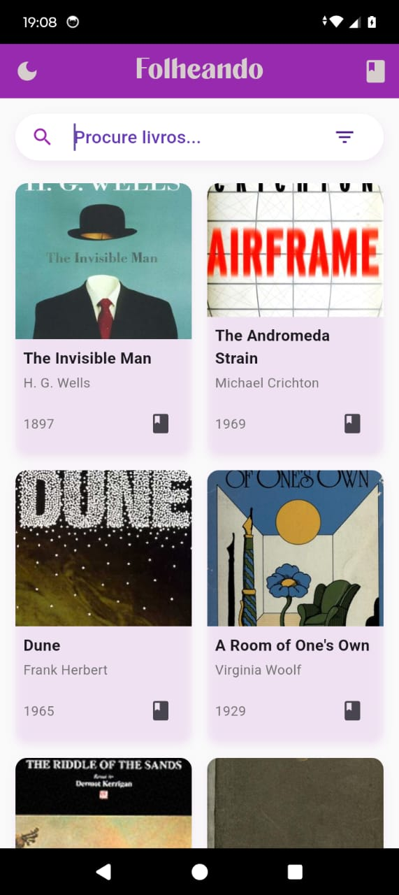

# 📚 Folheando

> Um aplicativo Flutter simples para descobrir, salvar e gerenciar seus livros favoritos.

## ✨ Características

- 🔍 Pesquisa de livros por título, autor ou categoria
- 📖 Visualização de informações dos livros
- ⭐ Sistema de avaliação e reviews pessoais
- 💜 Lista de favoritos personalizada
- 🌓 Modo claro/escuro
- 💾 Armazenamento local de dados

## 📱 Screenshots

  
  
<em>Tela inicial com grid de livros e busca</em>

  
  
<em>Detalhes do livro com sinopse e avaliações</em>

  
  
<em>Gerenciamento de livros favoritos</em>

## 🛠️ Tecnologias Utilizadas

- **Flutter** - Framework UI multiplataforma
- **Provider** - Gerenciamento de estado
- **Shared Preferences** - Armazenamento local
- **Open Library API** - Base de dados de livros

## 📱 Funcionalidades

### Pesquisa e Descoberta
- Pesquisa por título ou autor
- Filtros por categoria
- Visualização em grid com capas dos livros
- Informações detalhadas de cada obra

### Sistema de Favoritos
- Adicione/remova livros dos favoritos
- Avaliação com sistema de estrelas
- Campo para reviews pessoais
- Sincronização local automática

### Personalização
- Alternar entre modo claro e escuro

## 👤 Autor

Verônica Gabriela Martins Gomes
- GitHub: (@VegaMartins)(https://github.com/VegaMartins)

